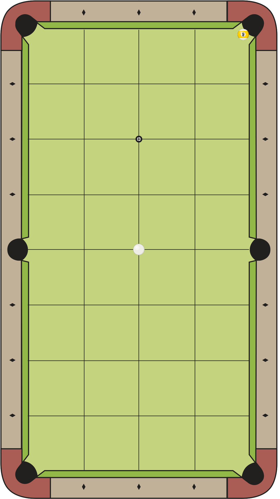

# Billiards

Tool and library for producing billiards diagrams, describing table layouts,
and running pool physics simulations.

For example, following diagram was created using simple Domain Specific
Language (DSL) included in project. DSL lets you describe table setups and ball
positions in clean, human-readable text format.



```text
# This can be in file like table.billiards

# Coordinate system uses "diamonds", with origin at bottom-left.
# `x` increases right. `y` increases upward in table space.

# Create standard 9ft table (default)
table brunswick_gc4_9ft

# Place cue ball at center spot
ball cue at center

# Place 9-ball at specific coordinate
ball nine at (3.93, 7.93)

# Freeze 8-ball to left rail at diamond 6
ball eight frozen left (6.0)
```

## Physics-aware shot DSL

DSL also supports declarative shot setup and named physics presets.

```text
ball cue at (1.0, 4.0)
ball one at (2.0, 4.0)
ball two at (3.6, 4.0)

cue_strike(default).mass_ratio(1.0).energy_loss(0.1)
ball_ball(human).normal_restitution(0.95).tangential_friction(0.06)
rail_response(clean).normal_restitution(0.8).tangential_friction(1.0)
rail_response(dead).normal_restitution(0.6).tangential_friction(1.0)
rails(pinball).default(clean).top(dead).right(dead)
simulation(human_pinball).collision_model(throw_aware).ball_ball(human).rail_model(spin_aware).rails(pinball).conditions(humid_dirty)
shot(cue).heading(90deg).speed(medium).tip(side: 0.0R, height: 0.0R).using(default)
```

`.speed(...)` is cue-stick speed at impact. It accepts explicit units (`128ips`, `10mph`, `16.09344kph`)
or Dr. Dave-style aliases: `touch`, `slow`, `medium-soft`, `medium`, `medium-fast`, `fast`,
`power`, plus break-speed aliases. Numbered stroke aliases `0`..`4` map to touch/slow/medium/fast/power.

Main knobs:

- `cue_strike(name)` → cue/ball transfer model
- `ball_ball(name)` → ball-ball restitution + tangential friction
- `rail_response(name)` → single-rail rebound config
- `rails(name)` → per-rail profile built from named rail responses
- `simulation(name)` → reusable preset bundling collision model, ball-ball config, rail model, rail profile, and optional built-in playing conditions
- `shot(cue)` → one declarative shot in document

For more:

- full syntax: [DSL_SHOT_MINI_SPEC.md](./DSL_SHOT_MINI_SPEC.md)
- built-in `simulation(...).conditions(...)` presets: `neutral` (default), `humid_dirty`, `fast_clean`
- ready examples: [examples/scenarios/](./examples/scenarios/)
- named-preset example: [examples/scenarios/named_physics_pinball.billiards](./examples/scenarios/named_physics_pinball.billiards)

## Thanks

Thanks to Dr. Dave Alciatore of Colorado State University for providing the
blank pool table diagram, which I used as a base image.
