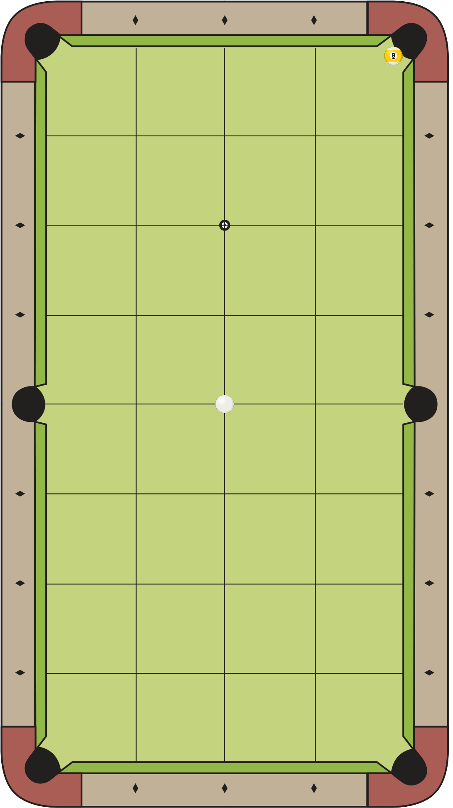

# Billiards

Tool and library for producing billiards diagrams, describing table layouts,
and running pool physics simulations.

For example, following diagram was created using simple Domain Specific
Language (DSL) included in project. DSL lets you describe table setups and ball
positions in clean, human-readable text format.



```text
# This can be in file like table.billiards

# Coordinate system uses "diamonds", with origin at bottom-left.
# `x` increases right. `y` increases upward in table space.

# Create standard 9ft table (default)
table brunswick_gc4_9ft

# Place cue ball at center spot
ball cue at center

# Place 9-ball at specific coordinate
ball nine at (3.93, 7.93)

# Freeze 8-ball to left rail at diamond 6
ball eight frozen left (6.0)
```

## Physics-aware shot DSL

DSL also supports declarative shot setup and named physics presets.

```text
ball cue at (1.0, 4.0)
ball one at (2.0, 4.0)
ball two at (3.6, 4.0)

cue_strike(default).mass_ratio(1.0).energy_loss(0.1)
ball_ball(human).normal_restitution(0.95).tangential_friction(0.06)
rail_response(clean).normal_restitution(0.8).tangential_friction(1.0)
rail_response(dead).normal_restitution(0.6).tangential_friction(1.0)
rails(pinball).default(clean).top(dead).right(dead)
simulation(human_pinball).collision_model(throw_aware).ball_ball(human).rail_model(spin_aware).rails(pinball).conditions(humid_dirty)
shot(cue).heading(90deg).speed(medium).tip(side: 0.0R, height: 0.0R).using(default)
```

`.speed(...)` is the cue ball's immediate post-strike launch speed, before cloth drag, roll-transition
losses, cushion losses, or collisions. It accepts explicit units (`128ips`, `10mph`, `16.09344kph`) or
Dr. Dave-style aliases: `touch`, `slow`, `medium-soft`, `medium`, `medium-fast`, `fast`, `power`, plus
break-speed aliases. Numbered stroke aliases `0`..`4` map to touch/slow/medium/fast/power.

Main knobs:

- `cue_strike(name)` → cue/ball transfer model
- `ball_ball(name)` → ball-ball restitution + tangential friction
- `rail_response(name)` → single-rail rebound config
- `rails(name)` → per-rail profile built from named rail responses
- `simulation(name)` → reusable preset bundling collision model, ball-ball config, rail model, rail profile, and optional built-in playing conditions
- `shot(cue)` → one declarative shot in document

For more:

- full syntax: [DSL_SHOT_MINI_SPEC.md](./DSL_SHOT_MINI_SPEC.md)
- built-in `simulation(...).conditions(...)` presets: `neutral` (default), `humid_dirty`, `fast_clean`
- ready examples: [examples/scenarios/](./examples/scenarios/)
- named-preset example: [examples/scenarios/named_physics_pinball.billiards](./examples/scenarios/named_physics_pinball.billiards)

## Browser SVG generator

The Rust renderer can be compiled to Wasm and hosted by the built-in preview server:

```bash
nix develop -c cargo xtask wasm-preview --serve
```

Then open the `Serving Wasm preview at ...` URL printed by the command. The xtask
server has no Python dependency. To build the static preview without starting the
server:

```bash
nix develop -c cargo xtask wasm-preview
```

The generated page keeps `.billiards` DSL text authoritative while exposing synchronized
heading, cue-tip, shot-speed, and cue-elevation instruments. User-facing shot speeds are shown in
km/h with the nearest named-speed hint; DSL and simulation values retain their explicit source
units. Edits in either representation re-render through the Wasm
`render_svg_report_from_dsl` binding; the report includes the same table-detail and playback
controls used by the validation gallery. Generated preview output lives in
`target/wasm-preview/`.

The editor includes a **Robust three-cushion search** card below the DSL. Choose a physics-evaluation
budget and player level, select **Find robust shot**, and inspect the score probability and ranked
finalists. A configured shot supplies the search seed and cue. A shotless three-ball setup uses a
deterministic neutral seed plus the cue named `default` (or the sole declared cue), falling back to
the canonical cue when no unambiguous declaration exists. **Apply best shot** or any ranked
candidate writes all five controls atomically and renders the result. Existing shots are updated;
shotless sources receive a new shot plus the selected or canonical cue declaration. Applying,
editing, or resetting the DSL invalidates the older search result.
Search mode is deterministic simulated annealing: it starts with geometry-guided and global proposals,
keeps periodic global proposals, and uses geometrically cooled, one-control-at-a-time local proposals
around an accepted state. Screening is steered by bounded progress tiers—cushions, first object contact,
then estimated 3D surface clearance to the remaining object—while held-out legal-score probability and
Wilson bounds alone determine final ranks. A run that validates no legal score reports no winner.
Three-cushion adjudication treats cue-ball height strictly above 1 inch over the resting center plane
at any time during the shot as a miss, so jump-assisted candidates cannot win.

For bounded three-cushion optimization, the Wasm package also exports
`robust_three_cushion_shot_from_dsl(source, iterations, playerLevel)`. `iterations` must be
between 16 and 10,000; `playerLevel` is `b`, `a`, or `pro`. The deterministic JSON report contains
`sourceHasShot`, the mapped shot-inaccuracy sigmas, exact evaluation accounting, Wilson-ranked
finalists, and the winning controls. `web/render-worker.js` exposes the same operation with
`{ id, action: "robust-shot-search", source, iterations, playerLevel }`; `id` must be a safe integer.
The page module exports `requestRobustThreeCushionSearch({ iterations, playerLevel, source? })`,
which routes that request through the shared worker and resolves to `{ search, elapsedMs }`.

The Wasm package also exports
`apply_robust_shot_candidate_to_dsl(source, heading, speed, tipSide, tipHeight, elevation)` for the
same atomic update-or-insert operation used by every candidate action.

## Thanks

Thanks to Dr. Dave Alciatore of Colorado State University for providing the
blank pool table diagram, which I used as a base image.
