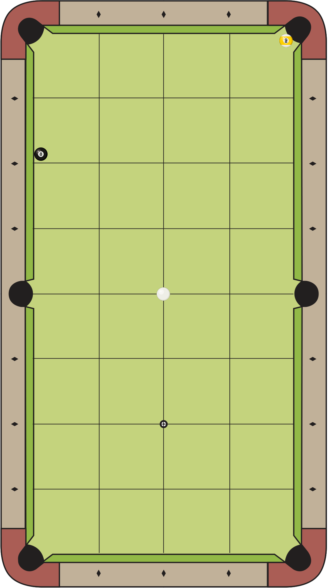

# Billiards

A tool and library for producing billiards diagrams and describing the
specifications of a game of pool/billiards. I might eventually add physics
simulations for pool.

For example, this diagram was created with the following code.



``` rust
    let mut game_state = GameState {
        table_spec: TableSpec::new_9ft_brunswick_gc4(),
        ball_positions: vec![
            Ball {
                ty: BallType::Cue,
                position: CENTER_SPOT.clone(),
                spec: BallSpec::default(),
            },
            Ball {
                ty: BallType::Nine,
                // TODO: Encode these positions as "hangers" in Position impl.
                position: Position {
                    x: Diamond::from("3.65"),
                    y: Diamond::from("7.625"),
                },
                spec: BallSpec::default(),
            },
        ],
        ..Default::default()
    };

    game_state.freeze_to_rail(
        Rail::Left,
        Diamond::six(),
        Ball {
            ty: BallType::Eight,
            position: Position::default(),
            spec: BallSpec::default(),
        },
    );

    let img = game_state.draw_2d_diagram();
    write_png_to_file(&img, None);
```

## Thanks

Thanks to Dr. Dave Alciatore of Colorado State University for providing the
blank pool table diagram, which I used as a base image.
